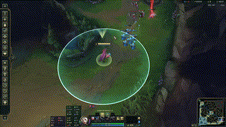

# Configurações e ajustes em atalhos - LOL


*Créditos: [Epic games](https://store.epicgames.com/en-US/p/league-of-legends)*

Olá player de **Lolzinho**.

Este guia explica como configurar o **RollerButtonSpeed**, desativando o zoom com o scroll do mouse. Acontece muito de esbarrar sem querer, reduzindo o campo de visão.

A outra configuração que pode ajudar na jogatina é para mapear um atalho duplo, exibindo o **alcance de ataque ao fixar a camera no campeão.**

Vou deixar as duas formas de realizar a configuração por questões de compatibilidade futura: editando o arquivo `input.ini` ou o arquivo `PersistedSettings.json`.

> [!TIP]
>  Localize o Diretório de Instalação do League of Legends

Por padrão, o League of Legends é instalado em:
```script
C:\Riot Games\League of Legends\
```

Se você alterou o diretório de instalação, ajuste o caminho conforme necessário.

# Desativar Zoom via mouse scroll

## Método 1: Editando o arquivo `input.ini`

<details>
<summary>passo a passo...</summary>
<br>

1. Navegue até o diretório:

```script
C:\Riot Games\League of Legends\Config
```

2. Abra o arquivo `input.ini` em um editor de texto, como o **Bloco de Notas**.

3. Adicione ou edite as seguintes linhas:
```script
[MouseSettings]
RollerButtonSpeed=0
```

  
*Exemplo no arquivo input.ini*

4. Salve o arquivo e feche o editor de texto.
</details>

## Método 2: Editando o arquivo `PersistedSettings.json`

<details>
<summary>passo a passo...</summary>
<br>

1. Navegue até o diretório:

  ```script
  C:\Riot Games\League of Legends\Config
  ```

2. Abra o arquivo `PersistedSettings.json` em um editor de texto.

3. Adicione ou edite o seguinte bloco de código no arquivo:
```json
{
   "name": "MouseSettings",
   "settings": [
       {
           "name": "RollerButtonSpeed",
           "value": "0"
       }
   ]
} 
```


*Exemplo no arquivo PersistedSettings.json*

> Certifique-se de manter a estrutura JSON válida. Não remova ou edite outras seções, a menos que saiba o que está fazendo.

4. Salve o arquivo e feche o editor de texto.
</details>

---

# Exibir alcance de ataque



Quando você aperta tecla de atalho `C`, é exibido o **alcance de ataque**. Para ter a praticidade de jogar sabendo o limite do seu campeão, nada melhor do que combinar esse atalho com a função de **fixar a camera**.

Eu jogo com a tela solta e quando preciso focar a camera no campeão, mantenho pressionada a tecla `Espaço`.

## Método 1: Editando o arquivo `input.ini`

<details>
<summary>passo a passo...</summary>
<br>

1. Navegue até o diretório:

```script
C:\Riot Games\League of Legends\Config
```

2. Abra o arquivo `input.ini` em um editor de texto, como o **Bloco de Notas**.

3. Adicione ou edite as seguintes linhas:
```csharp
evtShowCharacterMenu=[c],[space]
```

  
*Exemplo no arquivo input.ini*

4. Salve o arquivo e feche o editor de texto.

</details>


## Método 2: Editando o arquivo `PersistedSettings.json`

<details>
<summary>passo a passo...</summary>
<br>

1. Navegue até o diretório:

  ```script
  C:\Riot Games\League of Legends\Config
  ```

2. Abra o arquivo `PersistedSettings.json` em um editor de texto.

3. Adicione ou edite o seguinte bloco de código no arquivo:

```js
// Pesquise pela chave evtShowCharacterMenu dentro do arquivo PersistedSettings.json.
// Adicione o atalho para fixar a camera e o alcance de ataque.
{
    "name": "evtShowCharacterMenu",
    "value": "[c],[space]"
},
```


*Exemplo no arquivo PersistedSettings.json*

> Certifique-se de manter a estrutura JSON válida. Não remova ou edite outras seções, a menos que saiba o que está fazendo.

4. Salve o arquivo e feche o editor de texto.
</details>

## Dicas Finais

- Após realizar qualquer uma das configurações, reinicie o cliente do League of Legends para que as alterações sejam
  aplicadas.

- Caso algo dê errado, você pode excluir os arquivos `input.ini` e/ou `PersistedSettings.json`, pois o cliente recriará
  versões padrão desses arquivos ao iniciar.

## Referências

- [YouTube - Tutorial pra desativar scroll](https://www.youtube.com/watch?v=db7sTv3zYAg)
- [YouTube - Tutorial para sempre exibir o alcance de ataque](https://www.youtube.com/watch?v=hTs4veZcbo8)
- [Reddit - Conversa sobre desativar o scroll](https://www.reddit.com/r/leagueoflegends/comments/tvib4a/disable_zooming_inout_with_mouse_scroll_wheel/?rdt=56391)
- [Reddit - Exibir alcance do ataque](https://www.reddit.com/r/ADCMains/comments/1ejlzg5/comment/lgh39ku/?tl=pt-br&utm_source=share&utm_medium=web3x&utm_name=web3xcss&utm_term=1&utm_content=share_button)
